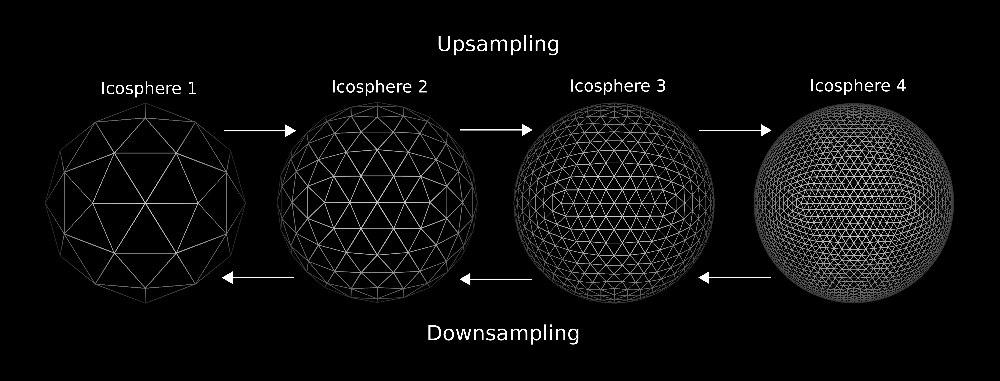
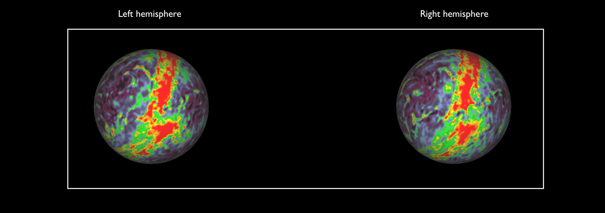
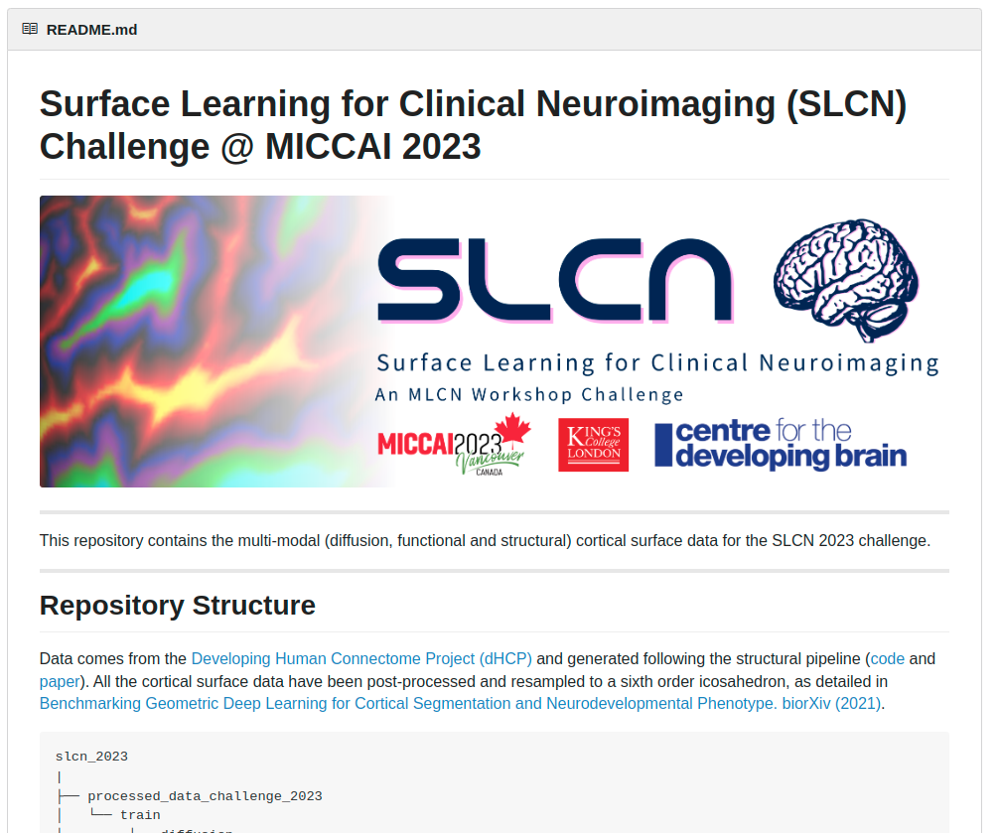

## OHBM 2024 - Surface Deep Learning Tutorial

This repository contains the codebase for the surface deep learning tutorial at the [OHBM2024 Educational Symposium on Precision Surface Imaging](https://metrics-lab.github.io/ohbm2024/).

Here, we introduce the tools to prepare surface data for surface deep learning. In particular, we detail the preprocessing steps to prepare cortical metrics and functional data in order to use the Surface Vision Transformer [SiT](https://arxiv.org/abs/2203.16414) and the Multiscale Surface Vision Transformer [MS-SiT](https://arxiv.org/abs/2303.11909) for cortical prediction & classification and cortical segmentation tasks.


# 1. Installation & Set-up

## A. Connectome Workbench

Connectome Workbench is a free software for visualising neuroimaging data and can be used for visualising cortical metrics on surfaces. Downloads and instructions [here](https://www.humanconnectome.org/software/connectome-workbench). 

## B. Conda usage

For PyTorch and dependencies installation with conda, please follow instructions in [install.md](docs/install.md).

## C. Docker usage

For docker support, please follow instructions in [docker.md](docs/docker.md)


# 2. Data Ppeprocessing & Access to preprocessed data

To simplify reproducibility of our work, data already preprocessed as in in [S. Dahan et al 2021](https://arxiv.org/abs/2203.16414) is available (see Section B). Otherwise, the following guideline provide the  preprocessing steps for custom datasets (Section A).

## A. Data preprocessing for surface deep learning

The following methodology is intended for processing cortical metrics and functional data in the format `shape.gii` and `func.gii`. We provide a bash script to recapitulate the preprocessing steps, that unfolds as follows: 

**a. Metric resampling**

Cortical metric or functional files must be resampled to ico6 mesh. We provide ico6 surface meshes, that goes with our triangular mesh patching. 

```
wb_command -metric-resample <metric-in> <current-sphere> <new-sphere> BARYCENTRIC <metric-out>ico-6.R.surf.gii ico-6.L.surf.gii
```

Where `<metric-in>` is the input metric or functional file, `<new-sphere>` being the ico6 sphere provided, `<current-sphere>` the sphere the input metric is currently registered to. 

For further details about the `metric-resample` command please follow [this](https://www.humanconnectome.org/software/workbench-command/-metric-resample).


If the original input data, is low resolution, it can be resampled to higher resolution sequentially. For this we provide the icoN resolution surfaces. 




**b. Left/Right hemisphere flipping**

For surface deep learning, right hemisphers are flipped such that they appear like right hemisphere on the sphere and all hemispheres are processed altogether in the training pipelines. We provide ico6 surfaces for both left and right hemispheres, however, we recommand resampling all metrics to ico6.L surface for consistency. 

Once symmetrised, both left and right hemispheres have the same orientation when visualised on a left hemipshere template. 



**c. Setting Cortex Left structure**

Finally, all the resulting metrics must be set to CORTEX LEFT structures. This can be done easily to all metrics files in a given folder, with the following command:

```
for i in *; do wb_command -metric-resample ${i} ../ico-6.R.surf.gii ../ico-6.L.surf.gii BARYCENTRIC ${i}; done
```


d. (optional) Patching surface data


## B. (Optional) Accessing processed data

Cortical surface metrics already processed as in [S. Dahan et al 2021](https://arxiv.org/abs/2203.16414) and [A. Fawaz et al 2021](https://www.biorxiv.org/content/10.1101/2021.12.01.470730v1) are available upon request. 

<details>
    <summary><b> How to access the processed data?</b></summary>
    <p>
    To access the data please:
    <br>
        <ul type="circle">
            <li> Sign the dHCP open access agreement [here](https://www.developingconnectome.org/data-release/second-data-release/open-access-dhcp-data-terms-of-use-version-4-0_2019-05-23/) </li>
            <li> Create a [GIN](https://gin.g-node.org/) account </li>
            <li> Send your GIN username with the dHCP signed form to <b> simon.dahan@kcl.ac.uk</b>  </li>
        </ul>
    </br>
    </p>
</details>
<details>
  <summary><b> G-Node GIN repository</b></summary>
      <p>
      Once the confirmation has been sent, you will have access to the <b>G-Node GIN repository</b> containing the data already processed.
      The data used for this project is in the zip files <i>`regression_native_space_features.zip`</i> and <i>`regression_template_space_features.zip`</i>. You also need to use the <i>`ico-6.surf.gii`</i> spherical mesh.
      </br>
      s

      </p>
</details>

**Training** and **validation** sets are available for the task of **birth-age** and **scan-age** prediction, in **template** and **native** configuration.

However the test set is not currently publicly available as used as testing set in the [SLCN challenge](https://slcn.grand-challenge.org/) on surface learning alongside the MLCN workshop at MICCAI 2022. 

# Citation

Please cite these works if you found it useful:

[Surface Vision Transformers: Attention-Based Modelling applied to Cortical Analysis](https://arxiv.org/abs/2203.16414)

```
@article{dahan2022surface,
  title={Surface Vision Transformers: Attention-Based Modelling applied to Cortical Analysis},
  author={Dahan, Simon and Fawaz, Abdulah and Williams, Logan ZJ and Yang, Chunhui and Coalson, Timothy S and Glasser, Matthew F and Edwards, A David and Rueckert, Daniel and Robinson, Emma C},
  journal={arXiv preprint arXiv:2203.16414},
  year={2022}
}
```
[The Multiscale Surface Vision Transformer](https://arxiv.org/abs/2204.03408)

```
@article{dahan2022surface,
  title={Surface Vision Transformers: Flexible Attention-Based Modelling of Biomedical Surfaces},
  author={Dahan, Simon and Xu, Hao and Williams, Logan ZJ and Fawaz, Abdulah and Yang, Chunhui and Coalson, Timothy S and Williams, Michelle C and Newby, David E and Edwards, A David and Glasser, Matthew F and others},
  journal={arXiv preprint arXiv:2204.03408},
  year={2022}
}
```


