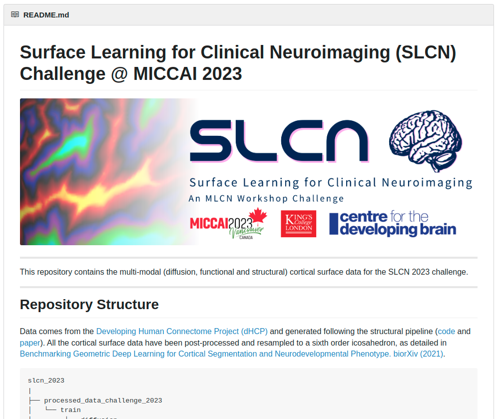

## Surface Deep Learning Tutorial

This repository contains the codebase for the surface deep learning tutorial at [OHBM 2024](https://www.humanbrainmapping.org/i4a/pages/index.cfm?pageid=4249).

Here, we show how to use the Surface Vision Transformer [SiT](https://arxiv.org/abs/2203.16414) and the Multiscale Surface Vision Transformer [MS-SiT](https://arxiv.org/abs/2303.11909) for cortical prediction & classification and cortical segmentation tasks.

# 1. Installation & Set-up

## A. Connectome Workbench

Connectome Workbench is a free software for visualising neuroimaging data and can be used for visualising cortical metrics on surfaces. Downloads and instructions [here](https://www.humanconnectome.org/software/connectome-workbench). 

## B. Conda usage

For PyTorch and dependencies installation with conda, please follow instructions in [install.md](docs/install.md).

## C. Docker usage

For docker support, please follow instructions in [docker.md](docs/docker.md)

# 2. Data Preprocessing & Access

To simplify reproducibility of the work, data already preprocessed as in in [S. Dahan et al 2021](https://arxiv.org/abs/2203.16414) is available (see Section B). Otherwise, follow the following guideline for preprocessing custom datasets. 

## B. Data preprocessing for surfae deep learning

## B. (Optional) Accessing processed data

Cortical surface metrics already processed as in [S. Dahan et al 2021](https://arxiv.org/abs/2203.16414) and [A. Fawaz et al 2021](https://www.biorxiv.org/content/10.1101/2021.12.01.470730v1) are available upon request. 

    
<b> How to access the processed data?</b>

    

    To access the data please:
     
        <ul type="circle">
            <li>Sign in <a href="https://data.developingconnectome.org/app/template/Login.vm">here</a> </li>
            <li>Sign the dHCP open access agreement </li>
            <li> Forward the confirmation email to <b> slcn.challenge@gmail.com</b>  </li>
        </ul>
     
    

  
<b> G-Node GIN repository</b>

      

      Once the confirmation has been sent, you will have access to the <b>G-Node GIN repository</b> containing the data already processed.
      The data used for this project is in the zip files <i>`regression_native_space_features.zip`</i> and <i>`regression_template_space_features.zip`</i>. You also need to use the <i>`ico-6.surf.gii`</i> spherical mesh. 
       
      

**Training** and **validation** sets are available for the task of **birth-age** and **scan-age** prediction, in **template** and **native** configuration.

However the test set is not currently publicly available as used as testing set in the [SLCN challenge](https://slcn.grand-challenge.org/) on surface learning alongside the MLCN workshop at MICCAI 2022. 
